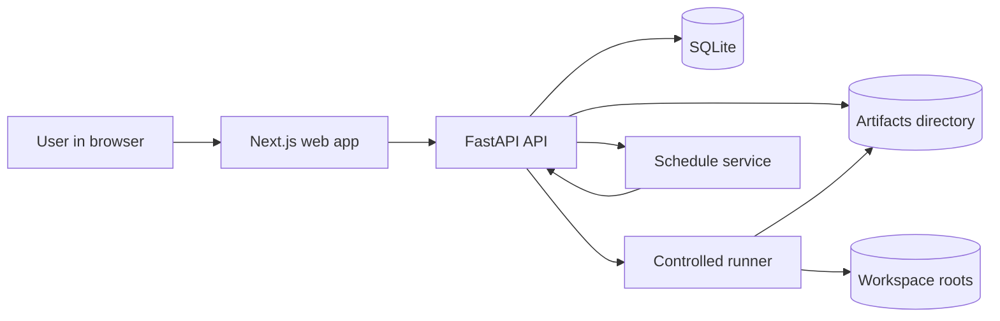
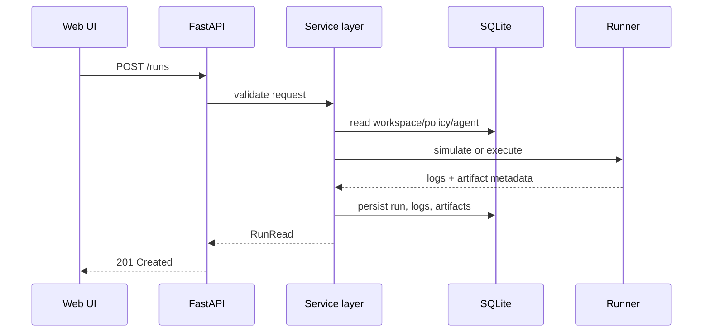

# Architecture

## Context

The system is built as a lightweight local web application. The browser UI talks to a local API. The API persists metadata in SQLite and stores generated artifacts on disk. A controlled runner executes or simulates agent commands inside a declared workspace root.

## High-level diagram

## Backend request flow

## Deployment shape

### Local developer mode
- frontend on `localhost:3000`
- backend on `localhost:8000`
- SQLite under `storage/sqlite`
- artifacts under `storage/artifacts`

### Container mode
- one container for web
- one container for API
- mounted local `storage/`
- mounted local `examples/`

## Design choices

- monorepo for coherence
- SQLite to minimize friction
- Pydantic contracts for backend boundaries
- dry-run execution until policy hardening is complete
- file-based artifacts for easy inspection

## Security notes

This is not a sandbox. It is a guarded local execution manager.
Therefore:
- default posture is deny / simulate
- all runner behavior must remain explicit
- real execution is gated by the global `execution_enabled` setting and
  workspace policy command-prefix allowlists
- controlled subprocess runs use explicit argument lists, workspace `cwd`,
  timeout, stdout/stderr capture, and no shell
- future hardening should consider per-run containerization or OS-level sandboxing
