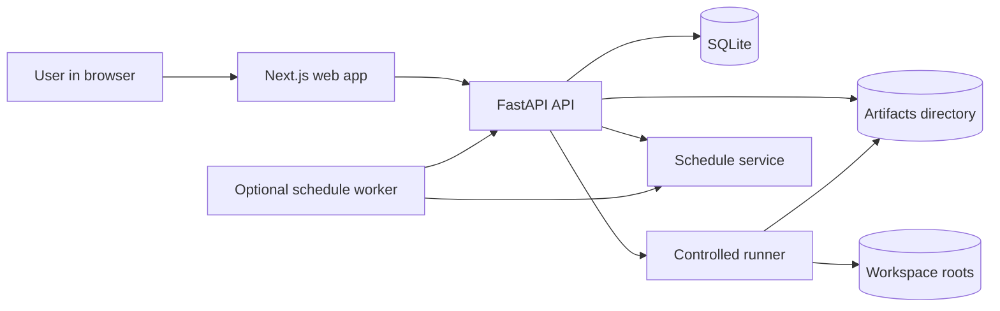
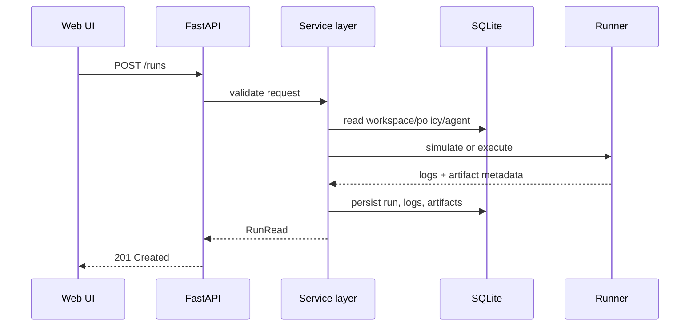

# Architecture

## Context

The system is built as a lightweight local web application. The browser UI talks to a local API. The API persists metadata in SQLite and stores generated artifacts on disk. A controlled runner executes or simulates agent commands inside a declared workspace root.

## High-level diagram

## Backend request flow

## Deployment shape

### Local developer mode
- frontend on `localhost:3000`
- backend on `localhost:8000`
- SQLite under `storage/sqlite`
- artifacts under `storage/artifacts`

### Container mode
- one container for web
- one container for API
- mounted local `storage/`
- mounted local `examples/`

### Schedule processing

The API can start an optional in-process schedule worker when
`LAWM_SCHEDULE_WORKER_ENABLED=true`. The worker polls SQLite at the configured
interval, claims due interval schedules with a conditional `next_run_at` update,
and creates dry-run runs with `trigger=schedule`. It is intentionally
single-machine and single-process for the MVP; distributed scheduling and full
cron parsing remain future work.

Cron schedules can be stored so the API contract is stable, but the MVP worker
does not parse or execute cron expressions.

## Design choices

- monorepo for coherence
- SQLite to minimize friction
- Pydantic contracts for backend boundaries
- dry-run defaults even when guarded real execution is available
- file-based artifacts for easy inspection

## Security notes

This is not a sandbox. It is a guarded local execution manager.
Therefore:
- default posture is deny / simulate
- all runner behavior must remain explicit
- real execution is gated by the global `execution_enabled` setting and
  workspace policy command-prefix allowlists
- controlled subprocess runs use explicit argument lists, workspace `cwd`,
  timeout, stdout/stderr capture, and no shell
- scheduled runs are dry-run by default and the worker is disabled unless
  explicitly enabled in configuration
- future hardening should consider per-run containerization or OS-level sandboxing

## MVP boundaries

Delivered:
- local API and web UI
- SQLite metadata persistence
- bounded workspace roots
- manual dry-runs and audited blocked/failed/completed real execution attempts
- optional interval schedule worker
- logs and file-based artifacts

Outside the MVP:
- distributed workers
- full cron parsing
- authentication and RBAC
- remote secrets management
- runtime-specific adapters for Copilot CLI or Codex
- OS-level isolation
