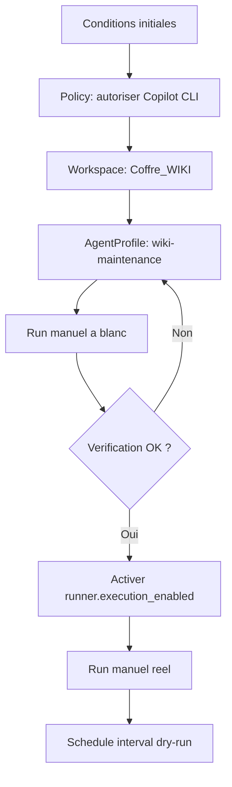
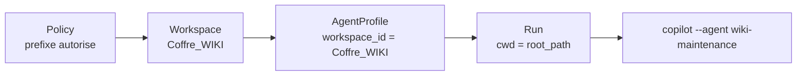
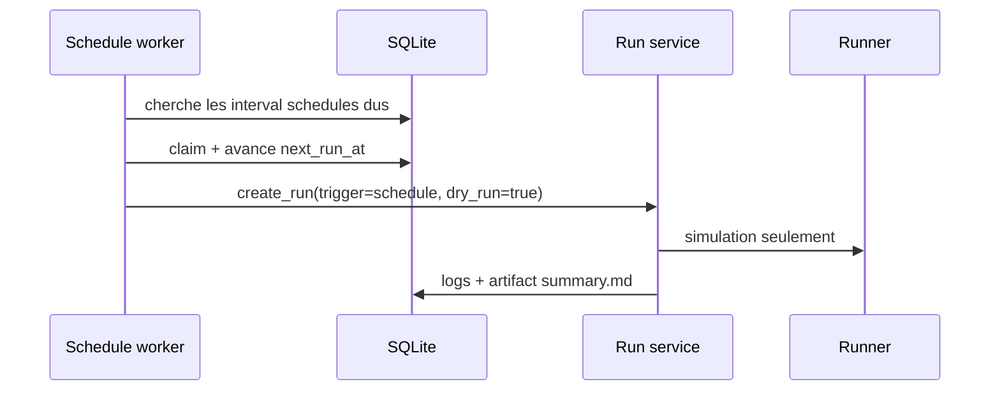

# Exemple complet - Agent de maintenance d'un coffre Obsidian avec GitHub Copilot CLI

Ce guide montre comment declarer, verifier, lancer puis planifier un agent de maintenance pour le coffre Obsidian `C:\...\Obsidian\Coffre_WIKI` avec Local Agent Workspace Manager.

L'objectif est volontairement strict :

- le workspace pointe uniquement vers le coffre Obsidian ;
- l'agent GitHub Copilot CLI est lie a ce workspace ;
- la policy autorise l'ecriture, mais seulement via le prefixe de commande attendu ;
- le premier lancement se fait a blanc ;
- l'execution reelle est activee explicitement seulement apres verification ;
- le schedule est ajoute ensuite, en tenant compte du comportement MVP actuel.

> Important : Local Agent Workspace Manager n'est pas un sandbox OS. Il borne le workspace, lie l'agent au workspace, controle le `cwd`, impose un timeout, capture les logs et bloque les commandes non autorisees par prefixe. Il ne peut pas empecher a lui seul un outil local autorise d'ecrire ailleurs si cet outil le permet. Le prompt de l'agent, le repertoire courant et la policy doivent donc rester coherents.

## Sources GitHub Copilot CLI

GitHub documente les agents personnalises Copilot CLI dans des fichiers Markdown `.agent.md`. Un agent de projet peut vivre dans `.github/agents/`, et l'appel programmatique documente utilise le nom du fichier sans l'extension, par exemple `copilot --agent security-auditor --prompt "..."`. Voir [Creating and using custom agents for GitHub Copilot CLI](https://docs.github.com/en/copilot/how-tos/copilot-cli/customize-copilot/create-custom-agents-for-cli).

GitHub documente aussi l'autopilot programmatique avec `--autopilot`, `--yolo` ou `--allow-all`, et `--max-autopilot-continues`. Dans ce guide, on limite volontairement le nombre de continuations pour reduire le risque de boucle ou de changements trop larges. Voir [Allowing GitHub Copilot CLI to work autonomously](https://docs.github.com/en/copilot/concepts/agents/copilot-cli/autopilot).

## Conditions initiales

### Chemins attendus

Dans les exemples, remplacez `<VOUS>` par votre profil Windows reel.

```text
C:/Users/<VOUS>/Obsidian/Coffre_WIKI
C:/Users/<VOUS>/Obsidian/Coffre_WIKI/.github/agents/wiki-maintenance.agent.md
```

Sous Windows, utilisez de preference des slashs `/` dans les valeurs JSON et `.env`. Les backslashs `\` doivent etre echappes dans du JSON.

### Etat attendu du coffre

Le coffre doit exister et contenir l'agent :

```powershell
Test-Path "C:/Users/<VOUS>/Obsidian/Coffre_WIKI"
Test-Path "C:/Users/<VOUS>/Obsidian/Coffre_WIKI/.github/agents/wiki-maintenance.agent.md"
```

Les deux commandes doivent retourner `True`.

### Exemple minimal de profil Copilot

Si le fichier existe deja, gardez votre version. Sinon, le contenu minimal peut ressembler a ceci :

```markdown
---
name: wiki-maintenance
description: Maintient un coffre Obsidian en corrigeant les liens, les index et les notes de synthese.
---

Tu es l'agent de maintenance du coffre Obsidian.

Regles obligatoires :
- travaille uniquement dans le repertoire courant ;
- ne lis ni n'ecris aucun fichier hors du coffre ;
- preserve les notes existantes ;
- corrige les liens Markdown casses quand la correction est evidente ;
- mets a jour les index et tables de contenu existants ;
- ne supprime jamais une note sans demande explicite ;
- produis un resume final listant les fichiers modifies et les points a verifier.
```

### GitHub Copilot CLI

Depuis PowerShell :

```powershell
where.exe copilot
copilot --version
```

Puis, depuis le coffre :

```powershell
Set-Location "C:/Users/<VOUS>/Obsidian/Coffre_WIKI"
copilot --agent wiki-maintenance --prompt "Verifie que l'agent wiki-maintenance est disponible. Ne modifie aucun fichier."
```

Si Copilot demande de faire confiance au dossier, acceptez uniquement si le chemin affiche est bien celui du coffre.

### Application locale

Depuis la racine du repository Local Agent Workspace Manager :

```powershell
Set-Location "E:/Users/<VOUS>/.../local-agent-workspace-manager"
```

Dans le fichier `.env` a la racine du repository, declarez le coffre comme racine autorisee :

```env
LAWM_WORKSPACE_ALLOWED_ROOTS=["C:/Users/<VOUS>/Obsidian"]
LAWM_EXECUTION_ENABLED=false
LAWM_SCHEDULE_WORKER_ENABLED=false
```

`LAWM_EXECUTION_ENABLED=false` est volontaire : on commence par une simulation.

Demarrez l'API :

```powershell
Set-Location "E:/Users/<VOUS>/.../local-agent-workspace-manager/apps/api"
py -3.12 -m uvicorn app.main:app --reload
```

Dans un autre terminal, verifiez :

```powershell
Invoke-RestMethod -Method Get -Uri "http://127.0.0.1:8000/health"
```

## Vue d'ensemble



## Partie 1 - Declaration et lancement manuel

Les appels ci-dessous utilisent l'API. Vous pouvez faire les memes actions dans l'interface web en suivant le meme ordre : Policies, Workspaces, Agents, Runs.

### 1. Creer la policy

La policy autorise l'ecriture et le reseau, car GitHub Copilot CLI a besoin d'appeler le service Copilot. Le prefixe autorise est volontairement plus strict que `copilot` seul.

```powershell
$policy = Invoke-RestMethod `
  -Method Post `
  -Uri "http://127.0.0.1:8000/policies" `
  -ContentType "application/json" `
  -Body '{
    "name": "Obsidian Wiki Maintenance - Copilot",
    "description": "Autorise uniquement le lancement de l agent wiki-maintenance dans le coffre Obsidian.",
    "max_runtime_seconds": 1800,
    "allow_write": true,
    "allow_network": true,
    "allowed_command_prefixes": [
      "copilot --agent wiki-maintenance"
    ]
  }'

$policy.id
```

Controle attendu :

```powershell
$policy.allow_write
$policy.allow_network
$policy.allowed_command_prefixes
```

Resultat attendu :

```text
True
True
copilot --agent wiki-maintenance
```

### 2. Creer le workspace

```powershell
$workspace = Invoke-RestMethod `
  -Method Post `
  -Uri "http://127.0.0.1:8000/workspaces" `
  -ContentType "application/json" `
  -Body (@{
    name = "Coffre WIKI Obsidian"
    slug = "coffre-wiki-obsidian"
    root_path = "C:/Users/<VOUS>/Obsidian/Coffre_WIKI"
    description = "Coffre Obsidian maintenu par un agent GitHub Copilot CLI."
    tags = @("obsidian", "wiki", "maintenance")
    status = "active"
    policy_id = $policy.id
  } | ConvertTo-Json)

$workspace.id
```

Controle attendu :

```powershell
$workspace.root_path
$workspace.policy_id
```

Le `root_path` retourne par l'API doit etre le chemin resolu du coffre, et `policy_id` doit etre l'identifiant cree a l'etape precedente.

Si l'API rejette le workspace, verifiez `LAWM_WORKSPACE_ALLOWED_ROOTS`. Le chemin `C:/Users/<VOUS>/Obsidian/Coffre_WIKI` doit etre sous une racine autorisee, par exemple `C:/Users/<VOUS>/Obsidian`.

### 3. Creer l'AgentProfile

Le nom d'agent Copilot est `wiki-maintenance`, car le fichier s'appelle `wiki-maintenance.agent.md`.

```powershell
$agent = Invoke-RestMethod `
  -Method Post `
  -Uri "http://127.0.0.1:8000/agents" `
  -ContentType "application/json" `
  -Body (@{
    name = "Wiki Maintenance Copilot"
    runtime = "copilot_cli"
    workspace_id = $workspace.id
    command_template = "copilot --agent wiki-maintenance --autopilot --yolo --max-autopilot-continues 6 --prompt `"Maintiens ce coffre Obsidian. Travaille uniquement dans le repertoire courant. Ne modifie aucun fichier hors du coffre. Corrige les liens Markdown evidents, mets a jour les index existants, conserve un resume final des fichiers modifies et des points a verifier.`""
    system_prompt = "Agent de maintenance du coffre Obsidian Coffre_WIKI. Scope strict: workspace courant uniquement."
    environment = @{}
    is_active = $true
  } | ConvertTo-Json)

$agent.id
```

Pourquoi ce profil est borne au coffre :

- `workspace_id` lie l'agent au workspace `Coffre WIKI Obsidian` ;
- le runner executera la commande avec `cwd` egal a `root_path` ;
- la policy n'autorise que les commandes qui commencent par `copilot --agent wiki-maintenance` ;
- le prompt repete explicitement la limite du repertoire courant.



### 4. Lancer a blanc

Un lancement a blanc cree un run, capture le `command_preview`, produit les logs et un artefact de resume, mais n'appelle pas reellement Copilot.

```powershell
$dryRun = Invoke-RestMethod `
  -Method Post `
  -Uri "http://127.0.0.1:8000/runs" `
  -ContentType "application/json" `
  -Body (@{
    workspace_id = $workspace.id
    agent_profile_id = $agent.id
    trigger = "manual"
    requested_by = "local-user"
    dry_run = $true
  } | ConvertTo-Json)

$dryRun
```

Resultat attendu :

```text
status  : completed
dry_run : True
```

Verifiez les logs :

```powershell
Invoke-RestMethod -Method Get -Uri "http://127.0.0.1:8000/runs/$($dryRun.id)/logs"
```

Vous devez voir notamment :

```text
Run requested for workspace coffre-wiki-obsidian.
Command preview: copilot --agent wiki-maintenance ...
Simulation complete; real execution remains disabled by default.
```

Verifiez l'artefact :

```powershell
Invoke-RestMethod -Method Get -Uri "http://127.0.0.1:8000/runs/$($dryRun.id)/artifacts"
```

Vous devez obtenir un `summary.md` sous `storage/artifacts/<run_id>/summary.md`.

### 5. Verifier le blocage de l'execution reelle

Avant d'activer l'execution globale, un run reel doit etre bloque. C'est un test de garde-fou.

```powershell
$blockedRun = Invoke-RestMethod `
  -Method Post `
  -Uri "http://127.0.0.1:8000/runs" `
  -ContentType "application/json" `
  -Body (@{
    workspace_id = $workspace.id
    agent_profile_id = $agent.id
    trigger = "manual"
    requested_by = "local-user"
    dry_run = $false
  } | ConvertTo-Json)

$blockedRun.status
```

Resultat attendu :

```text
blocked
```

Verifiez le message :

```powershell
Invoke-RestMethod -Method Get -Uri "http://127.0.0.1:8000/runs/$($blockedRun.id)/logs"
```

Vous devez voir :

```text
Execution blocked: real execution is disabled globally.
```

### 6. Activer l'execution reelle

L'activation se fait par setting persiste :

```powershell
Invoke-RestMethod `
  -Method Put `
  -Uri "http://127.0.0.1:8000/settings/runner.execution_enabled" `
  -ContentType "application/json" `
  -Body '{"value":"true"}'
```

Controle :

```powershell
Invoke-RestMethod -Method Get -Uri "http://127.0.0.1:8000/settings"
```

`runner.execution_enabled` doit valoir `true`.

### 7. Lancer reellement l'agent

Dernier controle manuel avant execution :

```powershell
$agent.command_template
$workspace.root_path
$policy.allowed_command_prefixes
```

Si tout est correct, lancez :

```powershell
$realRun = Invoke-RestMethod `
  -Method Post `
  -Uri "http://127.0.0.1:8000/runs" `
  -ContentType "application/json" `
  -Body (@{
    workspace_id = $workspace.id
    agent_profile_id = $agent.id
    trigger = "manual"
    requested_by = "local-user"
    dry_run = $false
  } | ConvertTo-Json)

$realRun
```

Resultats possibles :

- `completed` : Copilot CLI a termine avec un code de sortie `0` ;
- `failed` : Copilot CLI a retourne une erreur, a depasse le timeout, ou n'a pas pu demarrer ;
- `blocked` : le prefixe de commande ne correspond pas a la policy, ou l'execution globale est repassee a `false`.

Verifiez les logs :

```powershell
Invoke-RestMethod -Method Get -Uri "http://127.0.0.1:8000/runs/$($realRun.id)/logs"
```

Verifiez ensuite le coffre avec Git :

```powershell
Set-Location "C:/Users/<VOUS>/Obsidian/Coffre_WIKI"
git status --short
git diff --stat
git diff
```

Si le coffre n'est pas versionne, inspectez au minimum les fichiers recemment modifies :

```powershell
Get-ChildItem -Recurse "C:/Users/<VOUS>/Obsidian/Coffre_WIKI" |
  Where-Object { -not $_.PSIsContainer } |
  Sort-Object LastWriteTime -Descending |
  Select-Object -First 20 FullName, LastWriteTime
```

## Partie 2 - Integration dans un schedule

### Comportement actuel du scheduler

Dans le MVP actuel, le worker de schedule :

- est desactive par defaut ;
- traite les schedules `interval` uniquement ;
- ignore les schedules `cron` pour l'execution automatique ;
- cree des runs avec `trigger=schedule`, `requested_by=schedule-worker` et `dry_run=true`.

Cela veut dire que le schedule sert aujourd'hui a automatiser une verification a blanc et a conserver un audit trail. L'execution reelle planifiee automatique reste hors scope tant que le worker ne supporte pas explicitement `dry_run=false`.



### 1. Creer un schedule intervalle

Exemple : verification a blanc toutes les 24 heures.

```powershell
$schedule = Invoke-RestMethod `
  -Method Post `
  -Uri "http://127.0.0.1:8000/schedules" `
  -ContentType "application/json" `
  -Body (@{
    name = "Coffre WIKI - maintenance quotidienne a blanc"
    workspace_id = $workspace.id
    agent_profile_id = $agent.id
    mode = "interval"
    interval_minutes = 1440
    enabled = $true
  } | ConvertTo-Json)

$schedule
```

Controle attendu :

```powershell
$schedule.enabled
$schedule.mode
$schedule.next_run_at
```

`next_run_at` doit etre renseigne si le schedule est active.

### 2. Activer le worker

Arretez l'API, puis modifiez `.env` :

```env
LAWM_SCHEDULE_WORKER_ENABLED=true
LAWM_SCHEDULE_WORKER_POLL_SECONDS=60
```

Redemarrez l'API :

```powershell
Set-Location "E:/Users/.../local-agent-workspace-manager/apps/api"
py -3.12 -m uvicorn app.main:app --reload
```

Le worker demarrera avec l'application et traitera les schedules dus.

### 3. Tester rapidement le schedule

Pour ne pas attendre 24 heures, reduisez temporairement l'intervalle a 5 minutes :

```powershell
$schedule = Invoke-RestMethod `
  -Method Put `
  -Uri "http://127.0.0.1:8000/schedules/$($schedule.id)" `
  -ContentType "application/json" `
  -Body '{
    "interval_minutes": 5,
    "enabled": true
  }'

$schedule.next_run_at
```

Attendez que `next_run_at` soit passe, puis consultez l'historique :

```powershell
Invoke-RestMethod -Method Get -Uri "http://127.0.0.1:8000/runs"
```

Vous devez voir un run avec :

```text
trigger      : schedule
requested_by : schedule-worker
dry_run      : True
status       : completed
```

Consultez ses logs et artefacts comme pour un run manuel.

### 4. Remettre l'intervalle cible

```powershell
Invoke-RestMethod `
  -Method Put `
  -Uri "http://127.0.0.1:8000/schedules/$($schedule.id)" `
  -ContentType "application/json" `
  -Body '{
    "interval_minutes": 1440,
    "enabled": true
  }'
```

### 5. Desactiver temporairement le schedule

```powershell
Invoke-RestMethod `
  -Method Put `
  -Uri "http://127.0.0.1:8000/schedules/$($schedule.id)" `
  -ContentType "application/json" `
  -Body '{"enabled": false}'
```

Controle attendu :

```text
enabled     : False
next_run_at : null
```

## Checklist de fin

Avant de considerer l'integration terminee :

- `LAWM_WORKSPACE_ALLOWED_ROOTS` contient une racine parente du coffre, pas tout le disque `C:/` ;
- le workspace pointe vers `C:/Users/<VOUS>/Obsidian/Coffre_WIKI` ;
- l'agent est lie a ce workspace avec `workspace_id` ;
- la policy contient `allow_write=true` et `allow_network=true` ;
- `allowed_command_prefixes` contient `copilot --agent wiki-maintenance`, pas seulement `copilot` ;
- le dry-run manuel est `completed` ;
- le run reel bloque correctement quand `runner.execution_enabled=false` ;
- le run reel ne part qu'apres passage explicite de `runner.execution_enabled=true` ;
- les logs et l'artefact `summary.md` sont consultables ;
- le schedule cree des runs planifies a blanc ;
- toute execution reelle planifiee automatique est consideree hors scope du MVP actuel.
